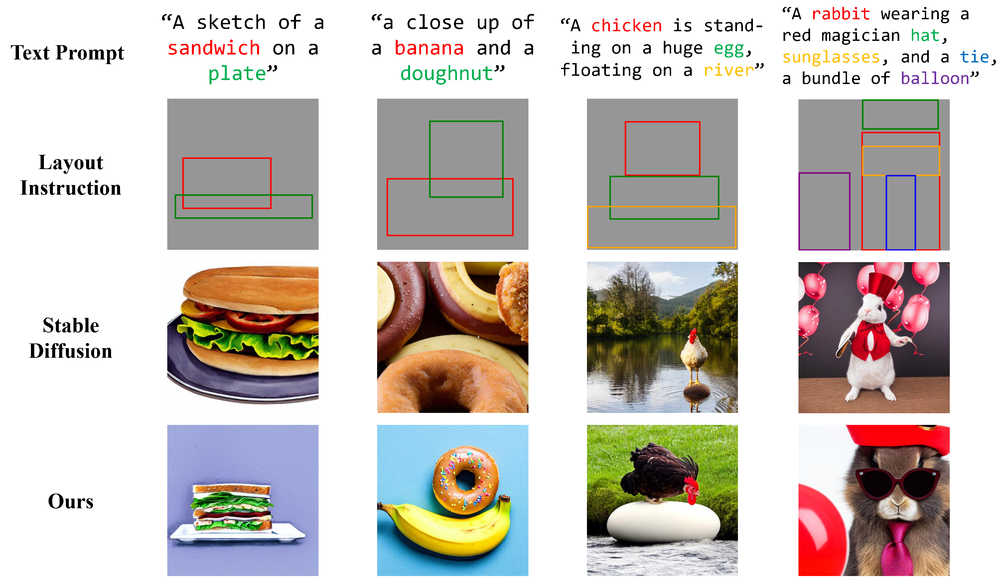
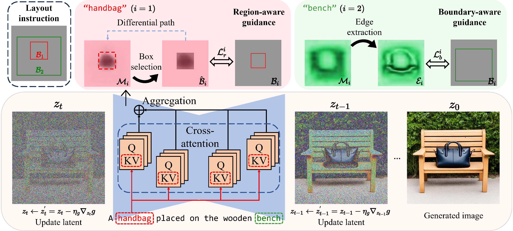

# R&B: Region and Boundary Aware Zero-shot Grounded Text-to-image Generation

[[Website](https://attention-refocusing.github.io)]

## Environment Setup

Run the following command to set up the environment:
```buildoutcfg
conda create -n RnB python=3.8
conda activate RnB
pip install -r requirements.txt
```

## Grounded Generation with Text-to-image diffusion models


## Framework



## Inference 


Outputs including log file, generated images, config file,  are saved to path `./example_output`. Detail configuration can be found in the `./conf/base_config.yaml` and `inference.py`. You can set the `model_path` in `./conf/base_config.yaml` as your own path to SD checkpoint.
```buildoutcfg
python inference_RnB.py general.save_path=./example_output 
```

## Acknowledgments

This project is built on the following resources:

- [**Layout-guidance**](https://github.com/silent-chen/layout-guidance): Our code is built upon the previous work on grounded generation, thanks for their awesome codebase. 

